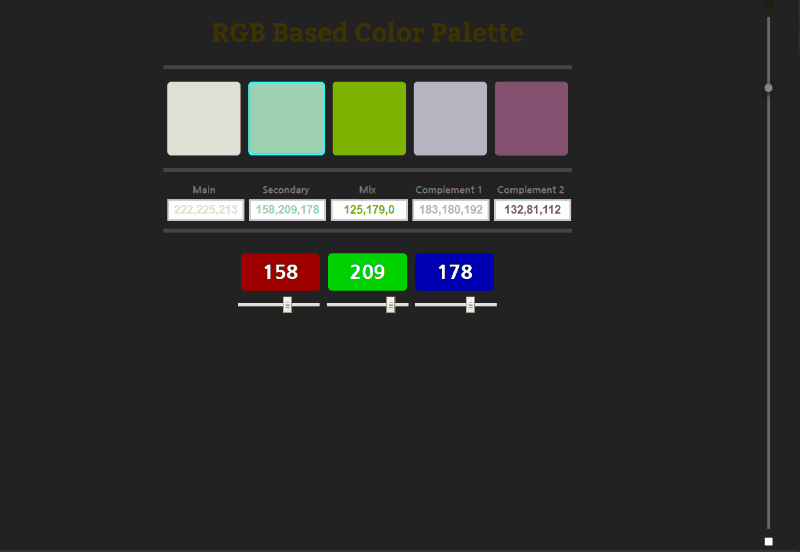

# Background Gamma

To see how the colors selected contrast with dark or light backgrounds use the Background Gamma slider located at the right of the screen. By dragging the knob you will be able to change the gamma for the background from 0% (Black) to 100% (White).

