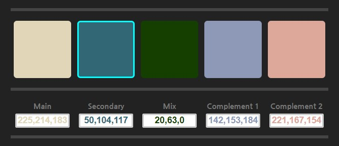

# RGB Color Palette

- [RGB Color Palette](#rgb-color-palette)
  - [Introduction](#introduction)
  - [Generating the Palette](#generating-the-palette)
  - [Future Implementations](#future-implementations)
  - [How to Install and Run the Application](#how-to-install-and-run-the-application)
- [Would you like to help?](#would-you-like-to-help)

## Introduction

Basic JavaScript (JS) based RGB Color Palette Generator. Simple to use.

First click either the Main or Secondary block, the move the sliders for the respective color. First slider represent Red, second slider represent Green and last Blue.

There are five color blocks which original RGB color value is:

```js
rgb(128,128,128);
```



When moving the sliders this values will change as soon as you let go of the mouse or sliding action.

The block order is as follow:

1. Main Color
2. Alternative (Secondary) Color
3. Color Mixer
4. Main Complementary Color
5. Alternate Complementary Color

## Generating the Palette

*__First Step:__*<br>By default, the Main Color block is highlighted, move the color slider until you are satisfied with the color generated by the combination of each color (R G B). Once you are done, click the second color block to select it, the block is selected when a cyan border is around it.

*__Second Step:__*<br>Once the second block is selected follow the first step. The third, fourth and fifth block will be automatically adjusted with `rgb()` background values.

*__Third Step:__*<br>The values used by the application are populated in the fields below the color blocks. For now, copy and paste each value.

Once is done, you can save the palette in three different formats (in the meantime :smile:): `json, scss` and `php` file extensions. [More Information](Saving.md)

## Future Implementations

In the future I will be adding other functionalities as saving palettes, alternative combinations, tertiary colors and more.

## How to Install and Run the Application

The application is build with Node.js, if you do not have `node` installed on your system, download it from the [Node.js official website](https://nodejs.org/). Download and install the LTS version. I'm planning to make this a native or web application when is more matured but in the meantime, this will do.

```console
$ ~/ npm --version
```

Once it is install, navigate to where the repository is located and install this application as follow:

```console
$ cd /location/of/repository/rgb-palette/
$ /location/of/repository/rgb-palette/> npm install
```

Once this is done, you need to create a folder on the root directory called `config`:

```console
$ /location/of/repository/rgb-palette/> mkdir config
```

___

**IMPORTANT NOTE** Then inside that directory, create a file called `.env` and `.test-env`. For the moment the app is not using this values, but `JWT_SECRET` global is required for a `middleware`.Once you create those files, you need to add the salt you want to use to authorized transactions on the app like this:

```ini

# PORT 3000 for .test-env and port designated for your
# application in Heroku or wherever you are hosting your app
PORT=3000 
JWT_SECRET=[the_secret_string_to_salt]

```
___

When all required dependencies are installed and the `config` directory with its content is created test the installation. If installation is successful you will be able to run the following statement:

```console
$ /location/of/repository/rgb-palette/> npm run start
```

If successful you should see

```console
> rgb-palette@1.0.0 start /location/of/repository/rgb-palette/
> node bin/app.js

Server is up in port 3000
```

Open your browser and browse to

```console
localhost:3000
```
or

```console
http://localhost:3000
```
___

# Would you like to help?

If you would like to contribute you can initialize the web server by using the `dev` format, which will run `node` using the [`nodemon`](https://www.npmjs.com/package/nodemon) dependency.
```s
npm run dev
```
`nodemon` is a very effective tool when developing with Node.js, because allows you to make changes to the code and the server is refreshed or restarted automatically after every specific file types have been saved.

I will be reviewing pull requests from time to time. Please be very specific when describing what you are trying to accomplish and what other ideas you might want to add.

---

Hope you enjoy it. Happy Coding, Happy Developing