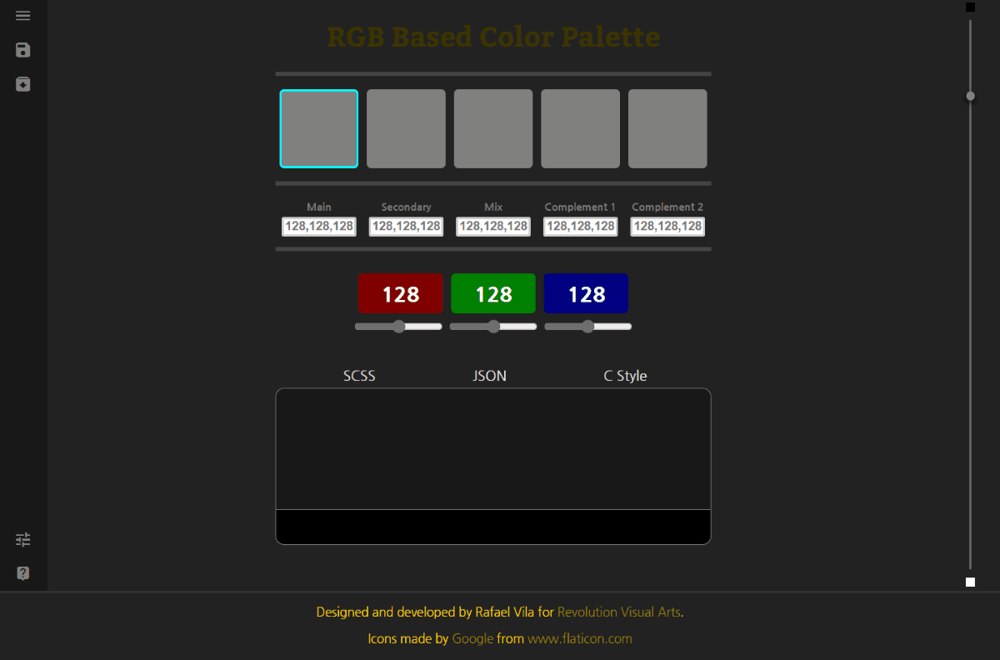
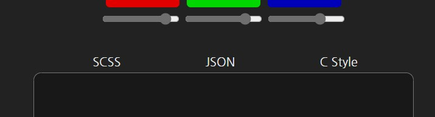
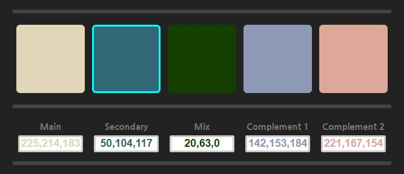

# Saving Palette
- [Saving Palette](#saving-palette)
  - [How to Save my Palette](#how-to-save-my-palette)
  - [Before Saving](#before-saving)
- [Want to help creating templates?](#want-to-help-creating-templates)
  - [Naming Template File](#naming-template-file)

## How to Save my Palette

To save the palette created to use it in your project you only need to click on the save button. In future revisions I will add keyboard shorcuts to save by simply using Ctrl + S or similar.



## Before Saving

Before saving the file you need to select the format you prefer. For now there is only three formats, I will be creating more templates as I keep adding features to this app.

1. SCSS - saves the file ready for SCSS implementation (`text/x-scss`) MIME type.
2. JSON - saves the file ready to transport the data into JavaScript projects or similar (`application/json`) MIME type.
3. PHP - save a PHP file (C-Style) object format (`application/x-http-php`) MIME type.



If a file format is not selected the app will simply ignore the command and send an alert.

# Want to help creating templates?

Simply create plain text files with the extension `.temp` with specific tags to point where the colors are going to be parsed and a comment statement with the MIME-type to be used. For example:

```js

//JS Object
const colorSet = {
        main: [main],
        alt: [secondary],
        mix: [mix],
        mainComp: [comp1],
        secComp: [comp2]
      };

var colorValues = {},
    setOrder = ['main','alt','mix','mainComp', 'secComp'];

for (i in colorSet) {
    colorValues[i] = colorSet[i].split(',');
}

//mime-type: application/js

```



|Tags|Color|
|:---|:----|
|[main]|Main Color|
|[secondary]|Secondary color|
|[mix]|Mix of both Main and Secondary colors (RGB based mix, blue and yellow don't make green :wink:)|
|[comp1]|Complementary color using the Main Color as reference|
|[comp2]|Complementary color using the Secondary Color as reference|

## Naming Template File

When naming the file use the following format:

```
[format]-template.temp
```

The format, __*without square brackets*__, is the file extension to be used, using the script above as an example: `js-template.temp`. The format might change in the future, too much redundancy :smile:.